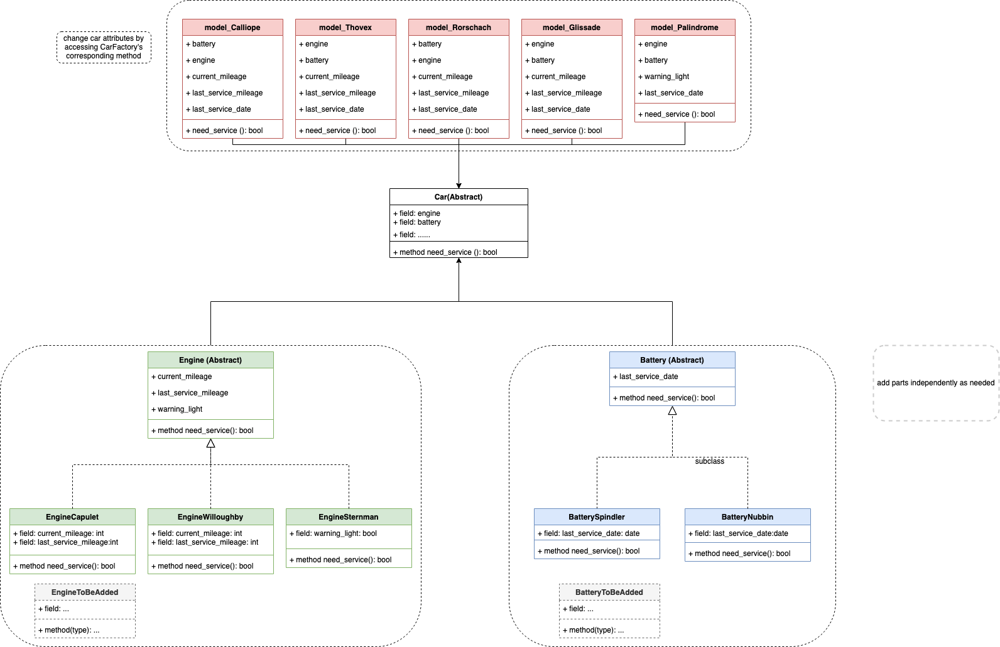

# Lyft Back-End Engineering

## Notes
- What I learned
    - basic of abstract class
    - relationship between abstract class and subclass
- Limitation
    - independent relationship
    - when a new car model/engine/battery is added, it requires to add new class